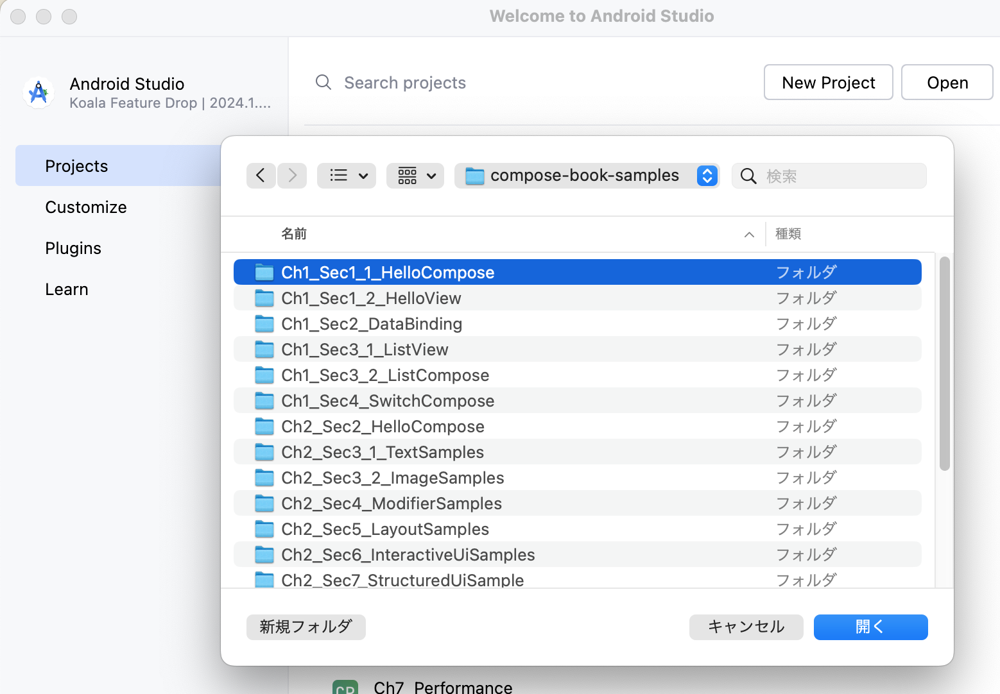
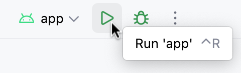

# 『詳解 Jetpack Compose』サンプルコード

このリポジトリでは、『詳解 Jetpack Compose』のサンプルコードを公開しています。

## 書籍について

臼井 篤志 著  
『詳解 Jetpack Compose ── 基礎から学ぶAndroidアプリの宣言的UI』  
技術評論社、2024年

- サポートページ  
https://gihyo.jp/book/2024/978-4-297-14488-3

## このリポジトリの構成

このリポジトリは20個のプロジェクトで構成されています。
プロジェクト名やファイル名の「Ch」と「Sec」はサンプルコードが登場する章と節の番号を表しています。

- （例）`Ch2_Sec4_ModifierSamples`：2.4節のModifierのサンプルコードのプロジェクト

### 実行方法

ソースコードをcloneまたはダウンロードしたら、Android Studioでプロジェクトを開きます。
リポジトリのルートディレクトリに配置されている「Ch〜」で始まるディレクトリがプロジェクトです。



各プロジェクトには実行可能なアプリ（`app`モジュール）が含まれています。
プロジェクトの読み込みが完了したら「Run」ボタンをクリックしてアプリを実行します。



### サンプルアプリの構成

第1章と第2章のサンプルアプリは、Composeの初心者がコードを読めるように、1つの画面に1つのコンポーザブル関数を配置しただけのシンプルな作りになっています。

第2章のサンプルはいろいろなコンポーザブル関数を紹介していますが、呼び出し元の`MainActivity.onCreate`でコンポーザブル関数を1つ選んで実行するようになっています。
別のコンポーザブル関数の動作を確認したい場合は、コメントアウトする行を変更して実行してください。

```Kotlin
class MainActivity : ComponentActivity() {
    override fun onCreate(savedInstanceState: Bundle?) {
        （省略）
        setContent {
            TextSamplesTheme {
                Scaffold(modifier = Modifier.fillMaxSize()) { innerPadding ->
                    Box(modifier = Modifier.padding(innerPadding)) {
                        TextSample1()
//                        TextSample2()
//                        TextSample3()
                    }
                }
            }
        }
    }
}
```

第3章以降のサンプルアプリは、一つのアプリの中にいろいろなサンプルを含んだ作りになっています。
アプリを実行するとサンプルのリストが表示されるので、見たいサンプルを選択してください。

### 各プロジェクトの説明

**Ch1_Sec1_1_HelloCompose**

- Buttonをタップすると文字列を表示するComposeのサンプル

**Ch1_Sec1_2_HelloView**

- Ch1_Sec1_1_HelloComposeと同じUIをViewで記述したサンプル

**Ch1_Sec2_DataBinding**

- Ch1_Sec1_1_HelloComposeと同じUIをDataBindingで記述したサンプル

**Ch1_Sec3_1_ListView**

- リストをComposeで実装したサンプル

**Ch1_Sec3_2_ListCompose**

- Ch1_Sec3_1_ListViewと同じリストをViewで実装したサンプル

**Ch1_Sec4_SwitchCompose**

- Composeのスイッチの状態管理を説明するサンプル

**Ch2_Sec2_HelloCompose**

- Hello, Compose!と表示するサンプル

**Ch2_Sec3_1_TextSamples**

- `Text`を利用して文字列を表示するサンプル

**Ch2_Sec3_2_ImageSamples**

- `Image`を利用して画像を表示するサンプル

**Ch2_Sec4_ModifierSamples**

- `Modifier`を利用してコンポーザブルの見た目や振る舞いをカスタマイズするサンプル

**Ch2_Sec5_LayoutSamples**

- `Column`、`Row`、`Box`を利用して複数のコンポーザブルを配置するサンプル

**Ch2_Sec6_InteractiveUiSamples**

- 動的に表示を変更するサンプル

**Ch2_Sec7_StructuredUiSample**

- 階層化と構造化により、複雑なUIをシンプルなコードで記述するサンプル

**Ch2_Sec8_PreviewSamples**

- On/Offスイッチのプレビューを表示するサンプル

**Ch3_KotlinUsageSample**

- デフォルト引数を活用した`AlertDialog`や`OutlinedTextField`の利用例
- コンポーザブル関数のラムダと通常関数のラムダを含むコードのサンプル
- 拡張関数のサンプル
- 委譲プロパティのサンプル

**Ch4_PracticalUiExample**

- 都道府県を紹介するサンプルアプリ

**Ch5_ComposeMechanismSample**

- 再コンポーズの起点、範囲、スキップを説明するサンプル
- 際コンポーズによりコンポジションの構造を変更するサンプル
- Strong Skipping Modeで表示が正しく更新される記述方法のサンプル
- `remember`、`rememberSaveable`のサンプル
- Coroutineのサンプル
- 副作用API（`SideEffect`、`LaunchedEffect`、`DisposableEffect`、`rememberCoroutineScope`、`rememberUpdatedState`）のサンプル
- Composeの作用と副作用の境界を説明するサンプル
- 単方向データフロー（UDF）のサンプル
- CompositionLocalのサンプル

**Ch6_DesignPattern**

- ステートフルなコンポーザブルとステートレスなコンポーザブルのサンプル
- クリックするたびに色が変化する`ColorfulBox`の状態をカプセル化するサンプル
- Flowのサンプル
- MVVMアーキテクチャによるTODOアプリの実装例

**Ch7_Performance**

- 大量の再コンポーズが発生するコードの例、大きな画像と小さな画像を表示する例
- フェーズを意識してパフォーマンスを改善する例
- `derivedStateOf`を利用してパフォーマンスを改善する例
- `@Immutable`を利用してパフォーマンスを改善する例
- Lazyコンポーザブルを利用してパフォーマンスを改善する例

**Ch8_ComposeTest**

- 商品の数量を入力する`QuantityPicker`コンポーザブルのテストの実装例

## ライセンス

このリポジトリ内のコードは全てMITライセンスのもとで公開します。
